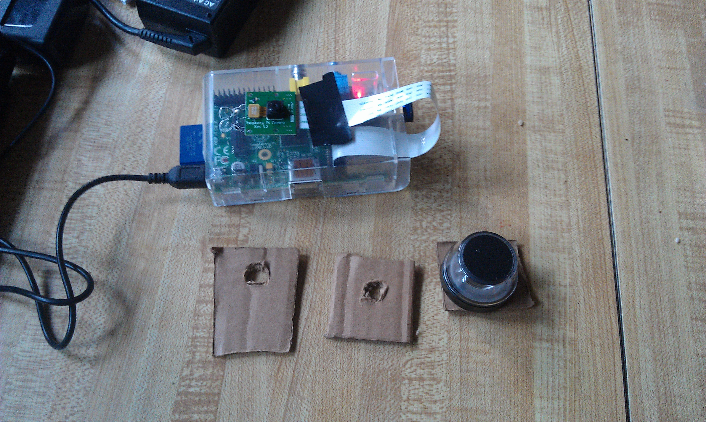
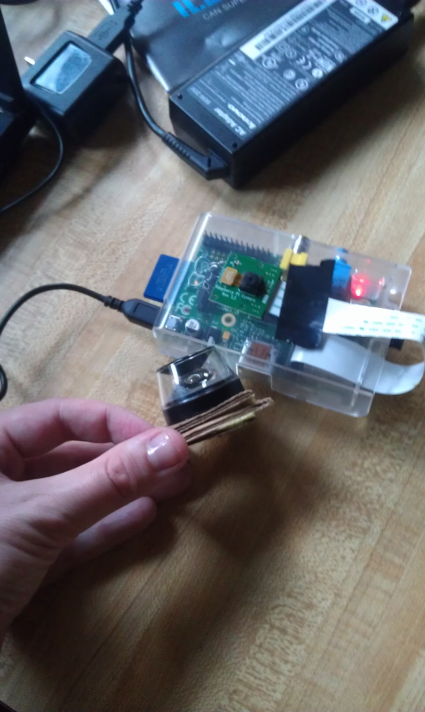
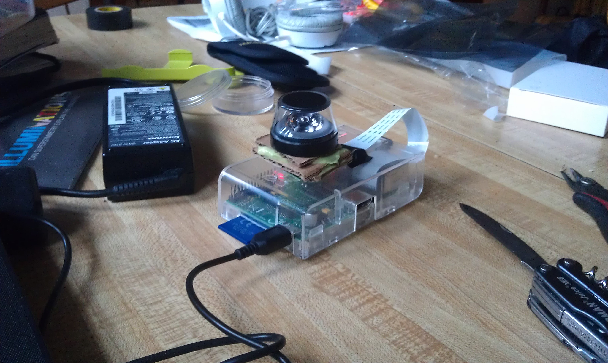
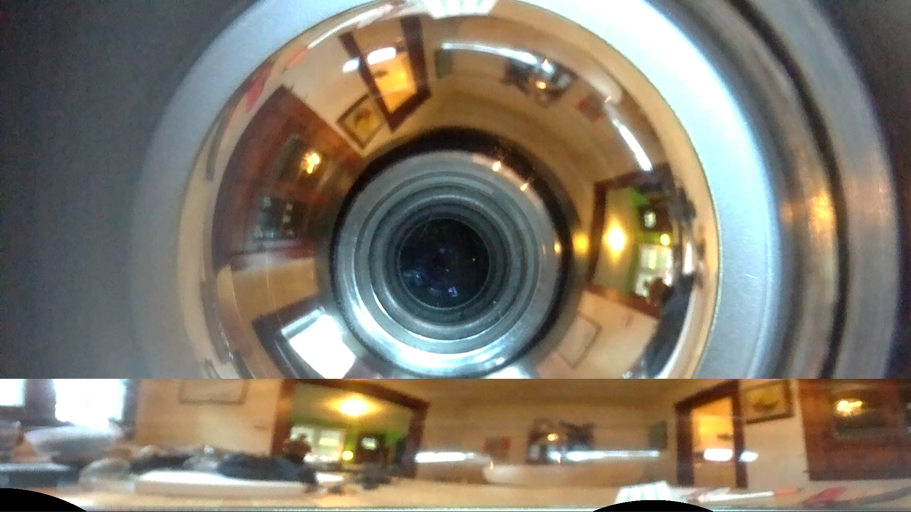

dewarp
======

Playing with the RasberryPi, odd lenses, and dewarping.

[The Input Video](http://www.youtube.com/watch?v=2RpXROkJuME)
[The Processed Output](http://www.youtube.com/watch?v=vwKxk1admOw)
